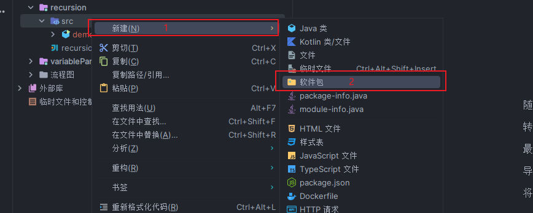
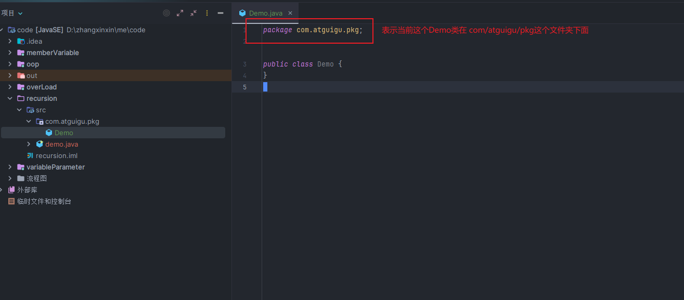

## 包的作用

- 可以分文件夹管理众多的类,没有包的话,所有的类都放在同一 src 下面,就会特别的乱
- 避免类的重名
- 限定某些类、成员的可见性范围

## 如何创建包

- idea 操作角度(创建包的方式 1)
  

- idea 操作角度(创建包的方式 2)

  > com.atguigu.two 是包名

  > Hello 是类名
  > 

- 代码角度
  

## 如何使用包中的类

1. 同一个包中的类互相使用,不需要导包

```java
package com.atguigu.two;

public class Hello {
    public static void main(String[] args) {

        World w = new World();
    }
}

```

```java
package com.atguigu.two;

public class World {

    Hello h = new Hello();
}

```

2. 不同包的类互相使用,需要导包或者全名称才能使用

> 导包使用

```java
package com.atguigu.pkg;

import com.atguigu.two.Hello; // 导包
import com.atguigu.two.World; // 导包

public class PkgHello {
    public static void main(String[] args) {
        Hello h = new Hello();
        World w = new World();
    }
}

```

> 全名称使用

> 当使用不同包的同名类时,只能存在一个 import 类,其余的只能使用全名称,例如 sql.Date 与 Date 是重名类

```java
package com.atguigu.pkg;

import java.util.Date;
//import java.sql.Date;

public class PkgHello {
    public static void main(String[] args) {
        // 全名称
        com.atguigu.two.Hello h = new com.atguigu.two.Hello();
        com.atguigu.two.World w = new com.atguigu.two.World();

        Date today = new Date();
        java.sql.Date now = new java.sql.Date(2023,12,06);
    }
}

```

3. 使用 java.lang 包中的类,不需要导包

   > 例如: String,System,Math 等

4. 导入包的注意事项

```java
package com.atguigu.pkg;

import java.util.Date; // 导入的类只能出现在package com.atguigu.pkg下面和class上面

import 包名.* // 如果使用了同一个包中的多个类,可以使用*代表全部导入
```

5. 非 public 修饰的类,是无法被跨包使用的

```java
package com.atguigu.pkg;

class Test {}
```

```java
package com.atguigu.two;

import com.atguigu.pkg.Test;

public class Hello {
  public static void main(String[] args) {
    Test t = new Test(); // 'com.atguigu.pkg.Test' 在 'com.atguigu.pkg' 中不为 public。无法从外部软件包访问
  }
}
```
