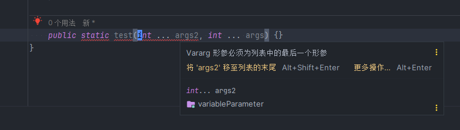
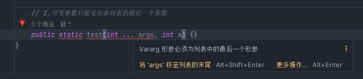
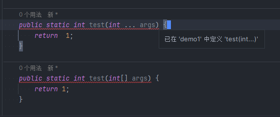

## 什么是可变参数?

> 可变参数的意思可以理解为,实参的个数可以变化,可以是不固定的

## 可变参数的语法格式

> (数据类型 ... 参数名)

> (数据类型 参数名 1, 数据类型 参数名 2, 数据类型 ... 参数名)

```java
// main
int max =  max(10, 20, 4, 30);
System.out.println(max);

public static int max(int num, int ... args) {
    int max = num;
    for(int i = 0; i < args.length; i ++) {
        if(max < args[i]){
            max = args[i];
        }
    }
    return max;
}
```

## 可变参数的特点和要求

> 1.一个方法最多只能声明一个可变参数
> 

> 2.可变参数只能是形参列表中的最后一个参数
> 

> 3.可变参数的形参可以当成数组使用

```java

// main
test(10,20,30);

public static int test(int ... args) {
    System.out.println(args[0]); // 10
    System.out.println(args[1]); // 20
    System.out.println(args[2]); // 30
    return 1;
}
```

> 4.可变参数的实参可以是 0~n 个元素

```java
// main
test(); // 没有传入实参
test(99); // 传入一个实参
test(10,20,30); // 传入n个实参

// 可变参数的实参可以是对应类型的数组对象
int[] arr = {1,2,3,4,5};
test(arr);

public static int test(int ... args) {
    int sum = 0;
    for (int i = 0; i < args.length; i++) {
        sum += args[i];
    }
    System.out.println(sum);
    return sum;
}
```

> 5.不会构成重载

```java
// int ...args 与 int[] args不会构成重载 因为 int ... args就已经相当于int[] args
```



> 6.可变参数列表,如果传入 0 个元素,数组是什么样的?

```java
// main
test(); // 传入0个实参时,相当于 new int[]{}
test(); // 传入0个实参时,相当于 new int[0]

// 传入n个元素,是如何变成数组的?
test(1,2,3,4,5); // 底层做了处理,处理后相当于new int []{1,2,3,4,5}
```

```java
public static void test(int ... args) {}
```
