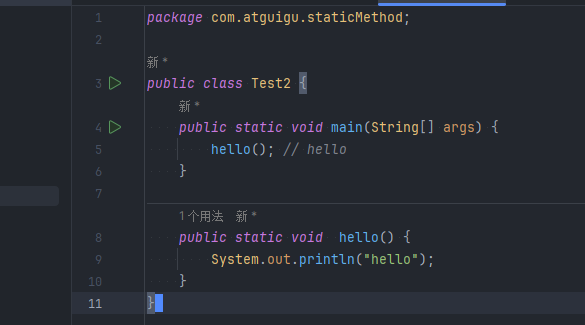
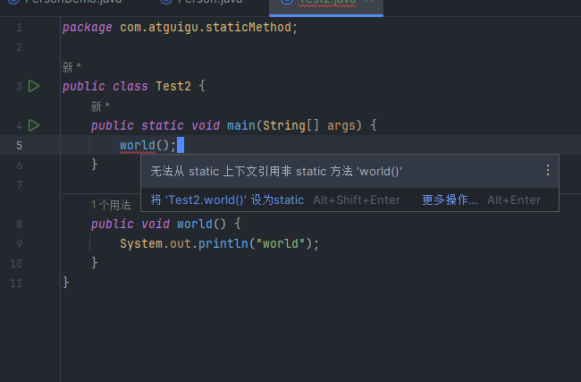
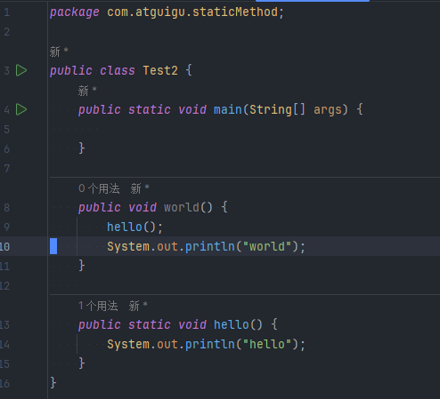
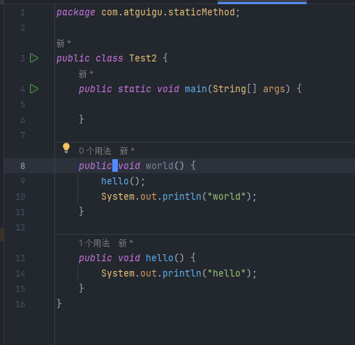
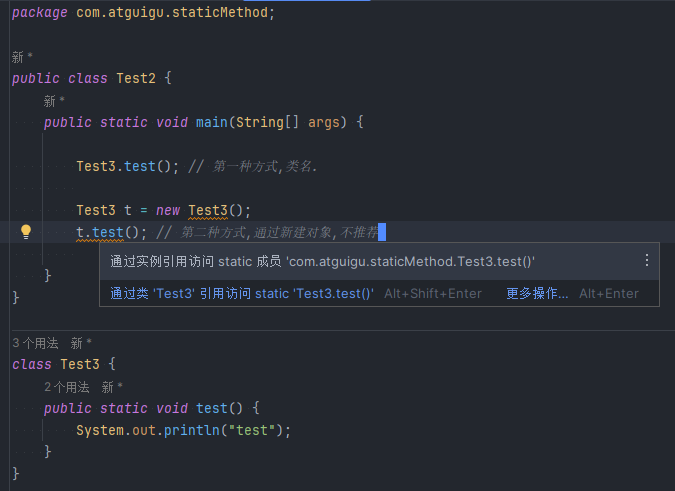

## 静态方法和非静态方法的区别

> 如果方法中需要使用到本类中非静态的属性,那么这个方法就不要声明为静态方法.

> 如果静态方法中实现的功能不依赖本类中的非静态属性完成,可以声明为静态方法

> 总而言之,言而总之,一句话,如果方法实现的功能要依赖于类中的属性完成,那么这个方法就不能是静态方法!!

> 被 static 修饰的属性是共享的

> 没有被 static 修饰的属性是独立的

## 静态方法注意事项

- 在本类中调用

> 1.静态方法调用本类中的静态方法可以直接调用,不需要加"对象.", 也不需要加"类名."
> 

> 2.静态方法中不可以直接调用本类中的非静态方法
> 

> 3.非静态方法可以直接调用静态方法,不需要加"对象.",也不需要加"类名."
> 

> 4.非静态方法中可以调用非静态方法
> 

- 在 A 类中调用 B 类中的静态方法

> 推荐使用: B 类名.静态方法

> 不推荐: B 类的对象名.静态方法(虽然编辑器不报错,但是编辑器会重新处理成 B 类名.静态方法)

> 
