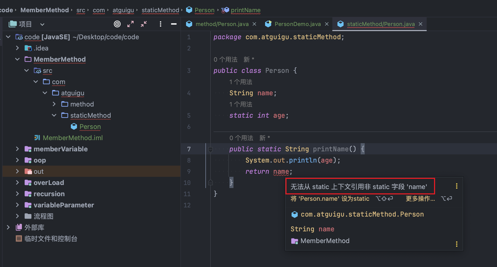

## 静态方法和非静态方法的区别

> 如果方法中需要使用到本类中非静态的属性,那么这个方法就不要声明为静态方法.

> 如果静态方法中实现的功能不依赖本类中的非静态属性完成,可以声明为静态方法

> 总而言之,言而总之,一句话,如果方法实现的功能要依赖于类中的属性完成,那么这个方法就不能是静态方法!!

> 被 static 修饰的属性是共享的

> 没有被 static 修饰的属性是独立的
