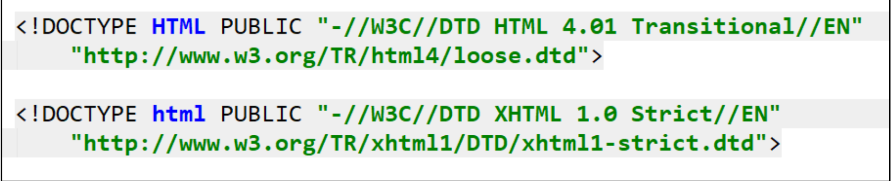
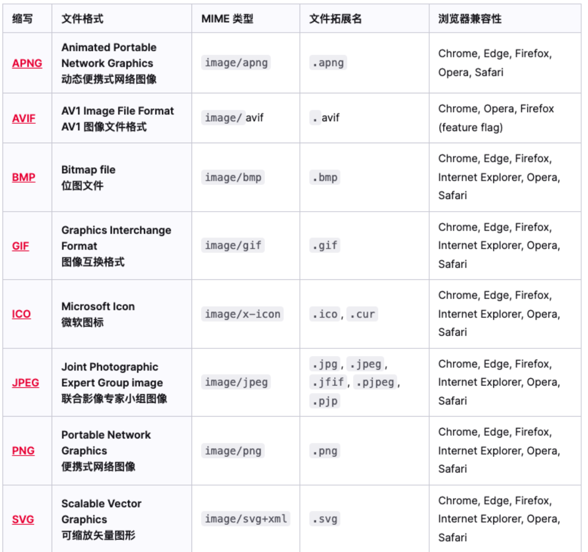
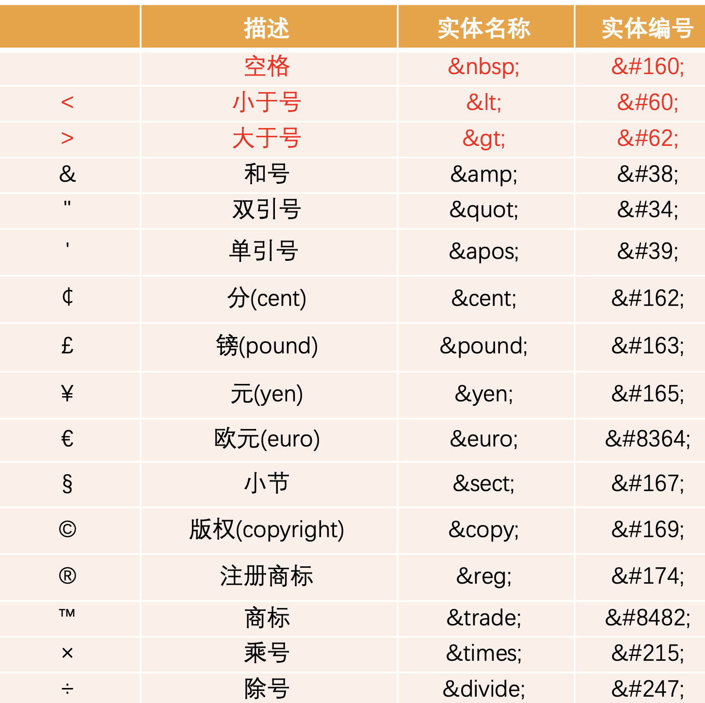

# HTML

## 网页的显示过程

```js
    例如在浏览器输入url地址时,网页是如何被显示并渲染的呢?
    1.浏览器输入url地址
    2.DNS服务器解析(domain name system)
    3.经过DNS解析之后,它会变为一个IP地址,会根据这个IP找到所对应的服务器,那么此时生成的IP地址是什么?
	  其实他是你所输入的那个url地址的真实服务器的地址,也就是说你想访问的那个网站,其实是在这台服务器中进行部署的!
	  这台服务器中存在着网页所需的静态资源(HTML,CSS,JS)
    4.将静态资源下载到浏览器中,浏览器会识别并解析这些静态资源,例如渲染引擎会解析HTML,CSS文件,浏览器内核中的JS引擎会解析JS文件.
    5.浏览器解析完静态资源后就可以展示完整的页面了.
```

## 浏览器内核

```js
	在上文中可以了解到一个网页的显示过程是由服务器先返回静态资源然后再让浏览器内核解析并进行渲染,从而可以得到一个完整的网页.
	但这个浏览器内核是什么东西?
	它是如何工作的呢?
	有多少种浏览器内核?
	这篇文章就按照这几个疑问来延伸!

	常见的浏览器内核:
		Trident: IE, 360, 搜狗, baidu, UC
		Gecko: Firefox
		Blink: Opera
		Webkit: Safari 移动端浏览器
		V8: Google Chrome
```

## 我对 HTML 的理解?

```js
	HTML是一种用于创建网页的"标记语言", 也称为超文本标记语言.
	HTML元素是构建网站的基石.

	什么是标记语言?
	1.由无数个标记(标签)组成.
	2.是对某些内容进行特殊的标记,以供其他解释器识别处理.
	3.例如使用<h1></h1>标记的文本会被识别为标题,从而被进行加粗和文字放大被显示出来.
	4.由标签和内容组成的部分称为元素.

	什么是超文本?
	就是不仅仅可以插入普通的文本,还可以插入图片,音频,视频等内容.
	还可以表示超链接,从一个网页跳到另一个网页.
```

## 元素的属性

```js
	元素也可以拥有属性(arrtrbute), 属性包含这个元素的额外信息,这些信息不会出现在实际的内容中.

	例如现在有两个h1元素,我想要将dusk的字体颜色变为红色,该如何实现呢?

	<body>
		<h1>dusk one</h1>
		<h1 class="title">dusk</h1>
	</body>

	<style>
		<!-- 错误示范: 如果直接使用元素选择器的话,他们两个的文字颜色都会变为红色 -->
		h1 {
			color: #f00;
		}

		<!-- 正确示范: 那么此时就知道原因了,我们需要为dusk文本所处的元素添加上一个唯一的标识,以便于我设置它的样式,并且不会影响到同标签类型元素的样式 -->
		.title {
			color: "#f00"
		}
	</style>
```

## 元素属性的分类

```js
	有些属性是公共的,每一个元素都可以设置.
	例如: class, id, title属性.
	有些属性是元素特有的.
	比如meta元素的charset属性,img元素的alt属性等.
```

## 元素的嵌套关系

```js
	某些元素的内容除了可以是文本之外,还可以是其他元素,这样就形成了元素的嵌套.
	<body>
		<!-- 父子关系 -->
		<ul>
			<li>dusk</li>
		</ul>

		<!-- 兄弟关系 -->
		<div>dusk1</div>
		<div>dusk2</div>
	</body>
```

## 文档声明

```html
<!DOCTYPE html>
```

- !DOCTYPE html 称之为 文档类型声明，用于声明文档类型

- HTML 文档声明，告诉浏览器当前页面是 HTML5 页面;
- 让浏览器用 HTML5 的标准去解析识别内容;
- 必须放在 HTML 文档的最前面，不能省略，省略了会出现兼容性问题;

> HTML5 的文档声明比 HTML 4.01、XHTML 1.0 简洁非常多
> 

## html 元素

```html
<html></html>
```

html 元素 表示一个 HTML 文档的根(顶级元素)，所以它也被称为根元素

所有其他元素必须是此元素的后代

> W3C 标准建议为 html 元素增加一个 lang 属性，作用是:

- 帮助语音合成工具确定要使用的发音
- 帮助翻译工具确定要使用的翻译规则

> 比如常用的规则:

- lang=“en”表示这个 HTML 文档的语言是英文
- lang=“zh-CN”表示这个 HTML 文档的语言是中文

## head 元素

HTML head 元素 规定文档相关的配置信息(也称之为元数据)，包括文档的标题，引用的文档样式和脚本等

> 元数据(meta data)，是描述数据的数据

> 这里我们可以理解成对整个页面的配置

> 常见的设置有哪些呢?一般会至少包含如下 2 个设置

- 网页的标题:title 元素

```html
<title>网页的标题</title>
```

- 网页的编码:meta 元素, 可以用于设置网页的字符编码，让浏览器更精准地显示每一个文字，不设置或者设置错误会导致乱码, 一般都使用 utf-8 编码，涵盖了世界上几乎所有的文字

```html
<meta charset="utf-8" />
```

## body 元素

body 元素里面的内容将是你在浏览器窗口中看到的东西，也就是网页的具体内容和结构

```html
<body>
  <ul>
    <li>dusk1</li>
    <li>dusk2</li>
    <li>dusk3</li>
  </ul>
</body>
```

## HTML 元素

https://developer.mozilla.org/zh-CN/docs/Web/HTML/Element

> 常用的元素

- p 元素、h 元素
- img 元素、a 元素、iframe 元素
- div 元素、span 元素
- ul、ol、li 元素
- button 元素、input 元素
- table、thead、tbody、thead、th、tr、td

## h 元素

一个页面中通常会有一些比较重要的文字作为标题，这个时候我们可以使用 h 元素。

h1 – h6 标题 (Heading) 元素呈现了六个不同的级别的标题

> Heading 是头部的意思，通常会用来做标题

> h1 级别最高，而 h6 级别最低

> 注意:h 元素通常和 SEO 优化有关系

```html
<h1>h1标题</h1>
<h2>h2标题</h2>
<h3>h3标题</h3>
<h4>h4标题</h4>
<h5>h5标题</h5>
<h6>h6标题</h6>
```

## p 元素

如果我们想表示一个段落，这个时候可以使用 p 元素

HTML p 元素(或者说 HTML 段落元素)表示文本的一个段落

> p 元素是 paragraph 单词的缩写，是段落、分段的意思

> p 元素多个段落之间会有一定的间距

```html
<p>我是一个段落dusk~</p>
```

## img 元素

我们应该如何告诉浏览器来显示一张图片呢?使用 img 元素

> HTML img 元素将一份图像嵌入文档

> img 是 image 单词的所以，是图像、图像的意思

> 事实上 img 是一个可替换元素( replaced element )

> img 有两个常见的属性

> src 属性:source 单词的缩写，表示源, 是必须写的，它包含了你想嵌入的图片的文件路径

> alt 属性:不是强制性的，有两个作用:

- 作用一:当图片加载不成功(错误的地址或者图片资源不存在)，那么会显示这段文本
- 作用二:屏幕阅读器会将这些描述读给需要使用阅读器的使用者听，让他们知道图像的含义

## img 元素 - 图片的路径

> 设置 img 的 src 时，需要给图片设置路径

- 网络图片: 一个 URL 地址, 网络图片的设置非常简单，给一个地址即可
- 本地图片: 本地电脑上的图片，后续会和 html 一起部署到服务

```html

```

## img 元素 - 图片的格式

> img 元素支持的图片格式非常多
> 

## a 元素

> 在网页中我们经常需要跳转到另外一个链接，这个时候我们使用 a 元素

> HTML a 元素(或称锚(anchor)元素): 定义超链接，用于打开新的 URL

> a 元素有两个常见的属性:

- href: Hypertext Reference 的简称, 指定要打开的 URL 地址, 也可以是一个本地地址
- target: 该属性指定在何处显示链接的资源, \_self 默认值，在当前窗口打开 URL, \_blank:在一个新的窗口中打开 URL,

```html
<a href="https://www.baidu.com" target="_blank">百度一下</a>
```

## a 元素 - 锚点链接

> 锚点链接可以实现:跳转到网页中的具体位置

> 锚点链接有两个重要步骤:

- 在要跳到的元素上定义一个 id 属性
- 定义 a 元素，并且 a 元素的 href 指向对应的 id

```html
<a href="#one">锚点一</a>
<a href="#two">锚点一</a>
<a href="#three">锚点一</a>

<p id="one">段落一</p>
<p id="two">段落二</p>
<p id="three">段落三</p>
```

## a 元素 - 图片链接

> img 元素跟 a 元素一起使用，可以实现图片链接

> 实现思路:

- a 元素中不存放文字，而是存放一个 img 元素
- 也就是 img 元素是 a 元素的内容

```html
<a href="https://www.baidu.com">
  
</a>
```

## iframe 元素

> 利用 iframe 元素可以实现:在一个 HTML 文档中嵌入其他 HTML 文档

> frameborder 属性用于规定是否显示边框,

- 1:显示
- 0:不显示

> a 元素 target 的其他值:

- \_parent:在父窗口中打开 URL
- \_top:在顶层窗口中打开 URL

## 不常用元素

> strong 元素:内容加粗、强调: 通常加粗会使用 css 样式来完成

> i 元素:内容倾斜: 通常斜体会使用 css 样式来完成

> code 元素:用于显示代码: 偶尔会使用用来显示等宽字体

> br 元素:换行元素

## HTML 全局属性

> 我们发现某些属性只能设置在特定的元素中: 比如 img 元素的 src、a 元素的 href

> 也有一些属性是所有 HTML 都可以设置和拥有的，这样的属性我们称之为 “全局属性(Global Attributes)

- 全局属性有很多:https://developer.mozilla.org/zh-CN/docs/Web/HTML/Global_attributes

> 常见的全局属性如下:

- id:定义唯一标识符(ID)，该标识符在整个文档中必须是唯一的。其目的是在链接(使用片段标识符)，脚本或样 式(使用 CSS)时标识元素
- class:一个以空格分隔的元素的类名(classes )列表，它允许 CSS 和 Javascript 通过类选择器或者 DOM 方法来选 择和访问特定的元素
- style:给元素添加内联样式
- title:包含表示与其所属元素相关信息的文本。 这些信息通常可以作为提示呈现给用户，但不是必须的

## 字符实体

> 我们编写的 HTML 代码会被浏览器解析, 如下代码是如何被解析的呢?

- 如果你使用小于号(<)，浏览器会将其后的文本解析为一个 tag
- 但是某些情况下，我们确实需要编写一个小于号(<)
- 这个时候我们就可以使用字符实体

```html
<span>&lt;hehehe&gt;</span>
```

- HTML 实体是一段以连字号(&)开头、以分号(;)结尾的文本(字符串)
- 实体常常用于显示保留字符(这些字符会被解析为 HTML 代码)和不可见的字符(如“不换行空格”)

> 常见的字符实体
> 

## 认识 URL

> URL 代表着是统一资源定位符(Uniform Resource Locator)

> 通俗点说:URL 无非就是一个给定的独特资源在 Web 上的地址

> 理论上说，每个有效的 URL 都指向一个唯一的资源

> 这个资源可以是一个 HTML 页面，一个 CSS 文档，一幅图像，等等

## URL 的格式

> [协议类型]://[服务器地址]:[端口号]/[文件路径][文件名]?[查询]#[片段 ID]

## URL 和 URI 的区别

> 和 URI 的区别:

- URI = Uniform Resource Identifier 统一资源标志符，用于标识 Web 技术使用的逻辑或物理资源
- URL = Uniform Resource Locator 统一资源定位符，俗称网络地址，相当于网络中的门牌号

> URI 在某一个规则下能把一个资源独一无二的识别出来

- URL 作为一个网络 Web 资源的地址，可以唯一将一个资源识别出来，所以 URL 是一个 URI
- 所以 URL 是 URI 的一个子集
- 但是 URI 并不一定是 URL

## 元素的语义化

> 元素的语义化:用正确的元素做正确的事情。

> 理论上来说，所有的 HTML 元素，都能实现相同的事情

> 标签语义化的好处:

- 方便代码维护
- 减少让开发者之间的沟通成本
- 能让语音合成工具正确识别网页元素的用途，以便作出正确的反应
- 有利于 SEO 等等

## 什么是 SEO?

> 搜索引擎优化(英语:search engine optimization，缩写为 SEO)是通过了解搜索引擎的运作规则来调整网站，以及提高网站 在有关搜索引擎内排名的方式
