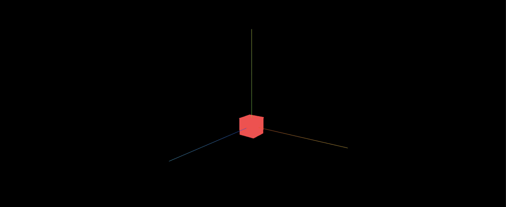

> 效果



> 实现代码

```js
import * as THREE from 'three';
import { OrbitControls } from 'three/examples/jsm/controls/OrbitControls';

// 添加坐标轴辅助器

const scene = new THREE.Scene();

const camera = new THREE.PerspectiveCamera(
  75,
  window.innerWidth / window.innerHeight,
  0.1,
  1000
);

camera.position.set(0, 0, 10);

scene.add(camera);

const cubeGeometry = new THREE.BoxGeometry(1, 1, 1);

const cubeMaterial = new THREE.MeshBasicMaterial({ color: 0xff4045 });

const cube = new THREE.Mesh(cubeGeometry, cubeMaterial);

scene.add(cube);

const renderer = new THREE.WebGLRenderer();

renderer.setSize(window.innerWidth, window.innerHeight);
document.body.appendChild(renderer.domElement);

const controls = new OrbitControls(camera, renderer.domElement);

// 添加坐标轴辅助器
const axesHelper = new THREE.AxesHelper(5);

// 将坐标轴辅助器添加到场景中
scene.add(axesHelper);

const render = () => {
  requestAnimationFrame(render);
  renderer.render(scene, camera);
};

render();
```

> 总结

1. 创建坐标轴辅助器并传入线段的长度,线段长度默认为'1': const axesHelper = new THREE.AxesHelper(5);
2. 将坐标轴辅助器添加到场景中, 确保能在场景中看到坐标轴辅助器: scene.add(axesHelper);
