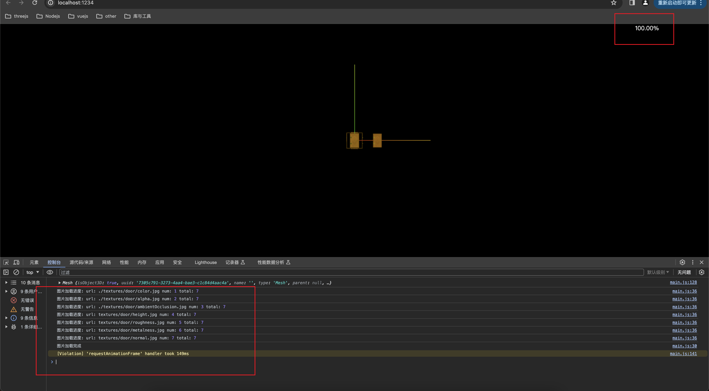

> 效果
> 

> 实现代码

```js
import * as THREE from 'three';
import { OrbitControls } from 'three/examples/jsm/controls/OrbitControls';

// 法线贴图的应用

const scene = new THREE.Scene();

const camera = new THREE.PerspectiveCamera(
  75,
  window.innerWidth / window.innerHeight,
  0.1,
  1000
);

camera.position.set(0, 0, 10);
scene.add(camera);

// 添加一个加载条
const progress = document.createElement('div');
progress.style.width = '200px';
progress.style.height = '200px';
progress.style.color = '#fff';
progress.style.position = 'fixed';
progress.style.right = 0;
progress.style.top = 0;
document.body.appendChild(progress);

// 编写事件函数
let eventList = {};

eventList.onLoad = function () {
  console.log('图片加载完成');
};

eventList.onProgress = function (url, num, total) {
  let value = ((num / total) * 100).toFixed(2) + '%';
  progress.innerText = value;
  console.log('图片加载进度:', 'url:', url, 'num:', num, 'total:', total);
};

eventList.onError = function (e) {
  console.log('图片加载出现错误', e);
};

// 添加加强管理器,用来获取纹理贴图的加载进度情况
const loadingManager = new THREE.LoadingManager(
  eventList.onLoad,
  eventList.onProgress,
  eventList.onError
);

// 导入纹理
const textureLoader = new THREE.TextureLoader(loadingManager); // loadingManager: 将加载管理器传入到纹理loader中即可
const doorColorTexture = textureLoader.load('./textures/door/color.jpg');
const doorAlphaTexture = textureLoader.load('./textures/door/alpha.jpg');
const AoTexture = textureLoader.load('./textures/door/ambientOcclusion.jpg');
// 导入置换贴图
const doorHeightTexture = textureLoader.load('textures/door/height.jpg');
// 导入粗糙度贴图
const doorRoughnessTexture = textureLoader.load('textures/door/roughness.jpg');
// 导入金属度贴图
const doorMetalnessTexture = textureLoader.load('textures/door/metalness.jpg');
// 导入法线贴图
const doorNormalTexture = textureLoader.load('textures/door/normal.jpg');

// 添加物体
const cubeGeometry = new THREE.BoxGeometry(1, 1, 1, 100, 100, 100);

// 设置材质
const material = new THREE.MeshStandardMaterial({
  color: '#ffff00',
  map: doorColorTexture,
  alphaMap: doorAlphaTexture,
  transparent: true,
  // opacity: 0.8,
  side: THREE.DoubleSide,
  aoMap: AoTexture,
  aoMapIntensity: 1,
  displacementMap: doorHeightTexture,
  displacementScale: 0.05,
  roughness: 1,
  roughnessMap: doorRoughnessTexture,
  metalness: 1,
  metalnessMap: doorMetalnessTexture,
  normalMap: doorNormalTexture,
});

// 为cube添加第二组uv
cubeGeometry.setAttribute(
  'uv2',
  new THREE.BufferAttribute(cubeGeometry.attributes.uv.array, 2)
);

const cube = new THREE.Mesh(cubeGeometry, material);
scene.add(cube);

const light = new THREE.AmbientLight('#ffffff'); // 添加环境光
scene.add(light);

// 从上方照射的白色平行光，强度为 0.5。
const directionalLight = new THREE.DirectionalLight(0xffffff, 0.5); // 添加平行光
// directionalLight.position.set(0, 1, 0); // 假如这个值设置为 Object3D.DEFAULT_UP (0, 1, 0)，光线将会从上往下照射
directionalLight.position.set(10, 10, 10); // 假如这个值设置为 Object3D.DEFAULT_UP (0, 1, 0)，光线将会从上往下照射
scene.add(directionalLight);

// 添加平面体
const planeGeometry = new THREE.PlaneGeometry(1, 1, 100, 100);
const planeMaterial = new THREE.MeshStandardMaterial({
  color: '#fff000',
  map: doorColorTexture,
  alphaMap: doorAlphaTexture,
  transparent: true,
  // opacity: 0.7,
  side: THREE.DoubleSide,
  aoMap: AoTexture,
  aoMapIntensity: 1,
  displacementMap: doorHeightTexture,
  displacementScale: 0.1,
  roughness: 0,
});

const plane = new THREE.Mesh(planeGeometry, planeMaterial);
plane.position.set(1, 0, 0);

// 为plane平面体添加第二组uv
planeGeometry.setAttribute(
  'uv2',
  new THREE.BufferAttribute(planeGeometry.attributes.uv.array, 2)
);
console.log(plane);
scene.add(plane);

const renderer = new THREE.WebGLRenderer();
renderer.setSize(window.innerWidth, window.innerHeight);
document.body.appendChild(renderer.domElement);

const controls = new OrbitControls(camera, renderer.domElement);
controls.enableDamping = true;

const axesHelper = new THREE.AxesHelper(5);
scene.add(axesHelper);

const render = () => {
  requestAnimationFrame(render);
  controls.update();
  renderer.render(scene, camera);
};

render();

// 根据尺寸的变化实现自适应画面

// 1.监听页面变化, 更新并渲染画面
window.addEventListener('resize', () => {
  console.log('变化');

  // 2.更新摄像头
  camera.aspect = window.innerWidth / window.innerHeight;

  // 3.更新摄像机的投影矩阵
  camera.updateProjectionMatrix();

  // 4.更新渲染器
  renderer.setSize(window.innerWidth, window.innerHeight);

  // 5.设置渲染器的像素比
  renderer.setPixelRatio(window.devicePixelRatio);
});
```
