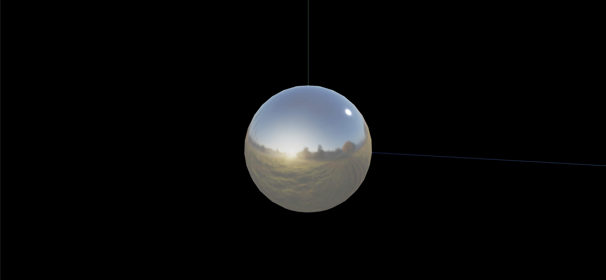

> 效果



> 实现代码

```js
import * as THREE from 'three';
import { OrbitControls } from 'three/examples/jsm/controls/OrbitControls';

// 法线贴图的应用

const scene = new THREE.Scene();

const camera = new THREE.PerspectiveCamera(
  75,
  window.innerWidth / window.innerHeight,
  0.1,
  1000
);

camera.position.set(0, 0, 10);
scene.add(camera);

// 创建cube纹理加载器
const cubeTextureLoader = new THREE.CubeTextureLoader();

// 添加环境纹理贴图
const envMapTexture = cubeTextureLoader.load([
  'textures/environmentMaps/1/px.jpg', // x轴正向
  'textures/environmentMaps/1/nx.jpg', // x轴反向
  'textures/environmentMaps/1/py.jpg', // y轴正向
  'textures/environmentMaps/1/ny.jpg', // y轴反向
  'textures/environmentMaps/1/pz.jpg', // z轴正向
  'textures/environmentMaps/1/nz.jpg', // z轴反向
]);

// 创建一个球体
const sphereGeometry = new THREE.SphereGeometry();
// 设置材质
const material = new THREE.MeshStandardMaterial({
  metalness: 0.7, // 设置金属度
  roughness: 0.1, // 设置粗糙度
  envMap: envMapTexture, // 设置环境贴图
});
const sphere = new THREE.Mesh(sphereGeometry, material);

// 添加到场景中
scene.add(sphere);

const light = new THREE.AmbientLight('#ffffff'); // 添加环境光
scene.add(light);

// 从上方照射的白色平行光，强度为 0.5。
const directionalLight = new THREE.DirectionalLight(0xffffff, 0.5); // 添加平行光
directionalLight.position.set(0, 1, 0); // 假如这个值设置为 Object3D.DEFAULT_UP (0, 1, 0)，光线将会从上往下照射
directionalLight.position.set(10, 10, 10); // 假如这个值设置为 Object3D.DEFAULT_UP (0, 1, 0)，光线将会从上往下照射
scene.add(directionalLight);

const renderer = new THREE.WebGLRenderer();
renderer.setSize(window.innerWidth, window.innerHeight);
document.body.appendChild(renderer.domElement);

const controls = new OrbitControls(camera, renderer.domElement);
controls.enableDamping = true;

const axesHelper = new THREE.AxesHelper(5);
scene.add(axesHelper);

const render = () => {
  requestAnimationFrame(render);
  controls.update();
  renderer.render(scene, camera);
};

render();

// 根据尺寸的变化实现自适应画面

// 1.监听页面变化, 更新并渲染画面
window.addEventListener('resize', () => {
  console.log('变化');

  // 2.更新摄像头
  camera.aspect = window.innerWidth / window.innerHeight;

  // 3.更新摄像机的投影矩阵
  camera.updateProjectionMatrix();

  // 4.更新渲染器
  renderer.setSize(window.innerWidth, window.innerHeight);

  // 5.设置渲染器的像素比
  renderer.setPixelRatio(window.devicePixelRatio);
});
```

> 总结

1. 创建 cube 纹理加载器: const cubeTextureLoader = new THREE.CubeTextureLoader();
2. 添加环境纹理贴图:

```js
const envMapTexture = cubeTextureLoader.load([
  'textures/environmentMaps/1/px.jpg', // x轴正向
  'textures/environmentMaps/1/nx.jpg', // x轴反向
  'textures/environmentMaps/1/py.jpg', // y轴正向
  'textures/environmentMaps/1/ny.jpg', // y轴反向
  'textures/environmentMaps/1/pz.jpg', // z轴正向
  'textures/environmentMaps/1/nz.jpg', // z轴反向
]);
```

3. 创建物体并在材质中设置 envMap 属性:

```js
const sphereGeometry = new THREE.SphereGeometry();
const material = new THREE.MeshStandardMaterial({
  metalness: 0.7,
  roughness: 0.1,
  envMap: envMapTexture,
});

const sphere = new THREE.Mesh(sphereGeometry, material);
scene.add(sphere);
```
