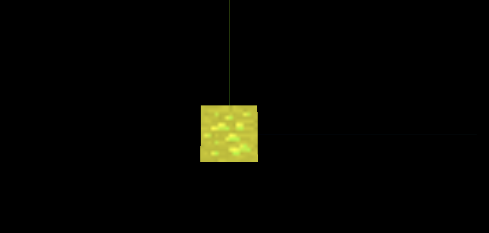
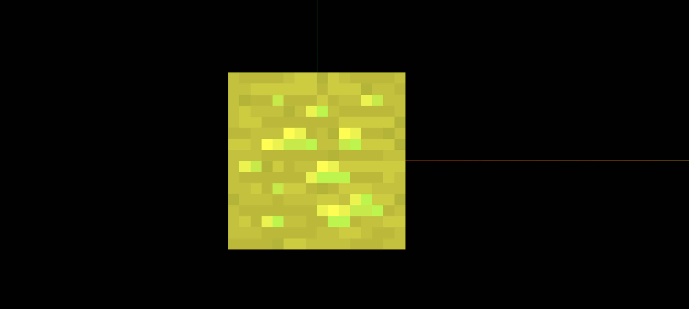

> 效果

> 默认值,线性: texture.minFilter = THREE.LinearFilter;

> 默认值,线性: texture.magFilter = THREE.LinearFilter;



> texture.minFilter = THREE.NearestFilter;

> texture.minFilter = THREE.NearestFilter;



```js
import * as THREE from 'three';
import { OrbitControls } from 'three/examples/jsm/controls/OrbitControls';

// 纹理的显示算法

const scene = new THREE.Scene();

const camera = new THREE.PerspectiveCamera(
  75,
  window.innerWidth / window.innerHeight,
  0.1,
  1000
);

camera.position.set(0, 0, 10);
scene.add(camera);

// 导入纹理
const textureLoader = new THREE.TextureLoader();
const texture = textureLoader.load('./textures/minecraft.png');

// 添加物体
const cubeGeometry = new THREE.BoxGeometry(1, 1, 1);

// 设置材质
const basicMaterial = new THREE.MeshBasicMaterial({
  color: '#ffff00',
  map: texture,
});

// texture纹理的显示设置
// texture.minFilter = THREE.NearestFilter;
// texture.magFilter = THREE.NearestFilter;
texture.minFilter = THREE.LinearFilter; // 默认值, 线性
texture.magFilter = THREE.LinearFilter; // 默认值, 线性

const cube = new THREE.Mesh(cubeGeometry, basicMaterial);
scene.add(cube);

const renderer = new THREE.WebGLRenderer();
renderer.setSize(window.innerWidth, window.innerHeight);
document.body.appendChild(renderer.domElement);

const controls = new OrbitControls(camera, renderer.domElement);
controls.enableDamping = true;

const axesHelper = new THREE.AxesHelper(5);
scene.add(axesHelper);

const render = () => {
  requestAnimationFrame(render);
  controls.update();
  renderer.render(scene, camera);
};

render();

// 根据尺寸的变化实现自适应画面

// 1.监听页面变化, 更新并渲染画面
window.addEventListener('resize', () => {
  console.log('变化');

  // 2.更新摄像头
  camera.aspect = window.innerWidth / window.innerHeight;

  // 3.更新摄像机的投影矩阵
  camera.updateProjectionMatrix();

  // 4.更新渲染器
  renderer.setSize(window.innerWidth, window.innerHeight);

  // 5.设置渲染器的像素比
  renderer.setPixelRatio(window.devicePixelRatio);
});
```
