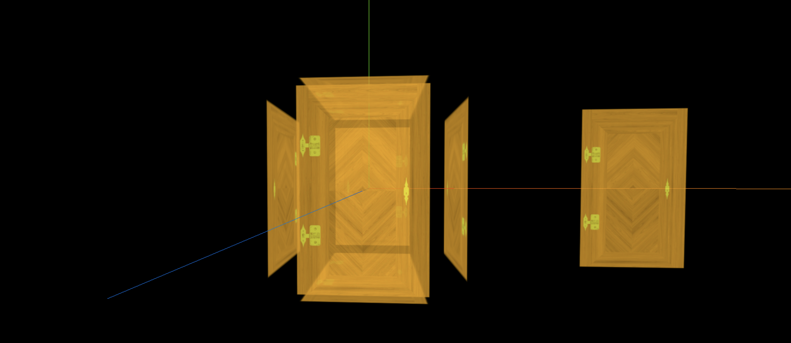

> 效果



```js
import * as THREE from 'three';
import { OrbitControls } from 'three/examples/jsm/controls/OrbitControls';

// 设置透明材质与透明纹理

const scene = new THREE.Scene();

const camera = new THREE.PerspectiveCamera(
  75,
  window.innerWidth / window.innerHeight,
  0.1,
  1000
);

camera.position.set(0, 0, 10);
scene.add(camera);

// 导入纹理
const textureLoader = new THREE.TextureLoader();
const doorColorTexture = textureLoader.load('./textures/door/color.jpg');
const doorAlphaTexture = textureLoader.load('./textures/door/alpha.jpg');

// 添加物体
const cubeGeometry = new THREE.BoxGeometry(1, 1, 1);

// 设置材质
const basicMaterial = new THREE.MeshBasicMaterial({
  color: '#ffff00', // 材质的颜色(Color)，默认值为白色 (0xffffff)
  map: doorColorTexture, // 颜色贴图。可以选择包括一个alpha通道，通常与.transparent 或.alphaTest。默认为null
  alphaMap: doorAlphaTexture, // alpha贴图是一张灰度纹理，用于控制整个表面的不透明度。（黑色：完全透明；白色：完全不透明）。 默认值为null。
  transparent: true, // 定义此材质是否透明, 设置为true时, 通过设置材质的opacity属性来控制材质透明的程度, 默认值为false
  opacity: 0.8, // 在0.0 - 1.0的范围内的浮点数，表明材质的透明度。值0.0表示完全透明，1.0表示完全不透明, 如果材质的transparent属性未设置为true，则材质将保持完全不透明，此值仅影响其颜色。 默认值为1.0
  side: THREE.DoubleSide, // 正反面都显示, 默认只显示正面
});

// 添加平面体
const plane = new THREE.Mesh(new THREE.PlaneGeometry(1, 1), basicMaterial);
plane.position.set(3, 0, 0);
scene.add(plane);

const cube = new THREE.Mesh(cubeGeometry, basicMaterial);
scene.add(cube);

const renderer = new THREE.WebGLRenderer();
renderer.setSize(window.innerWidth, window.innerHeight);
document.body.appendChild(renderer.domElement);

const controls = new OrbitControls(camera, renderer.domElement);
controls.enableDamping = true;

const axesHelper = new THREE.AxesHelper(5);
scene.add(axesHelper);

const render = () => {
  requestAnimationFrame(render);
  controls.update();
  renderer.render(scene, camera);
};

render();

// 根据尺寸的变化实现自适应画面

// 1.监听页面变化, 更新并渲染画面
window.addEventListener('resize', () => {
  console.log('变化');

  // 2.更新摄像头
  camera.aspect = window.innerWidth / window.innerHeight;

  // 3.更新摄像机的投影矩阵
  camera.updateProjectionMatrix();

  // 4.更新渲染器
  renderer.setSize(window.innerWidth, window.innerHeight);

  // 5.设置渲染器的像素比
  renderer.setPixelRatio(window.devicePixelRatio);
});
```
