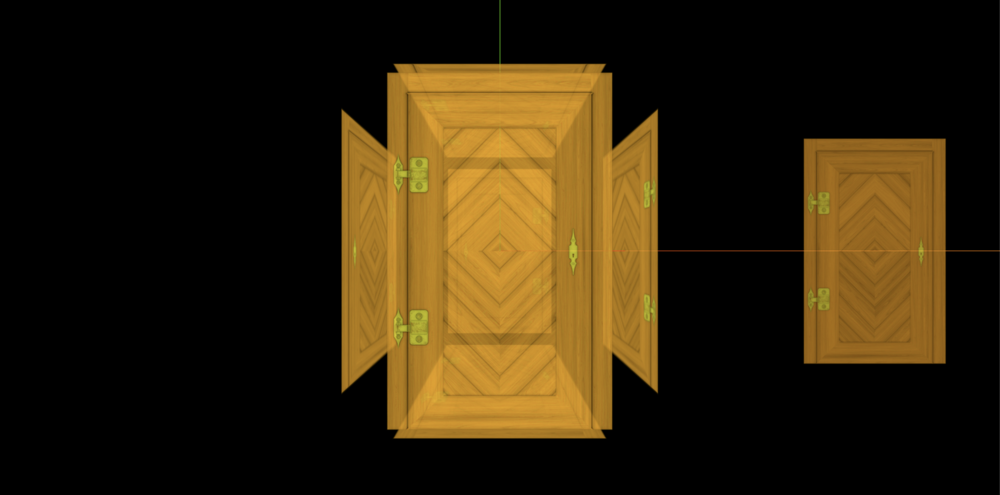

> 效果



> 实现代码

```js
import * as THREE from 'three';
import { OrbitControls } from 'three/examples/jsm/controls/OrbitControls';

// 设置环境遮挡贴图与修改强度

const scene = new THREE.Scene();

const camera = new THREE.PerspectiveCamera(
  75,
  window.innerWidth / window.innerHeight,
  0.1,
  1000
);

camera.position.set(0, 0, 10);
scene.add(camera);

// 导入纹理
const textureLoader = new THREE.TextureLoader();
const doorColorTexture = textureLoader.load('./textures/door/color.jpg');
const doorAlphaTexture = textureLoader.load('./textures/door/alpha.jpg');
// 导入环境遮挡贴图
const AoTexture = textureLoader.load('./textures/door/ambientOcclusion.jpg');

// 添加物体
const cubeGeometry = new THREE.BoxGeometry(1, 1, 1);

// 设置材质
const basicMaterial = new THREE.MeshBasicMaterial({
  color: '#ffff00',
  map: doorColorTexture,
  alphaMap: doorAlphaTexture,
  transparent: true,
  opacity: 0.8,
  side: THREE.DoubleSide,
  aoMap: AoTexture, // 设置环境遮挡贴图
  aoMapIntensity: 1, // 设置强度
});

// 为cube添加第二组uv
cubeGeometry.setAttribute(
  'uv2',
  new THREE.BufferAttribute(cubeGeometry.attributes.uv.array, 2)
);

const cube = new THREE.Mesh(cubeGeometry, basicMaterial);
scene.add(cube);

// 添加平面体
const planeGeometry = new THREE.PlaneGeometry(1, 1);
const planeBasicMaterial = new THREE.MeshBasicMaterial({
  color: '#fff000',
  map: doorColorTexture,
  alphaMap: doorAlphaTexture,
  transparent: true,
  opacity: 0.7,
  side: THREE.DoubleSide,
  aoMap: AoTexture,
  aoMapIntensity: 0.8,
});

const plane = new THREE.Mesh(planeGeometry, planeBasicMaterial);
plane.position.set(1.5, 0, 0);

// 为plane平面体添加第二组uv
planeGeometry.setAttribute(
  'uv2',
  new THREE.BufferAttribute(planeGeometry.attributes.uv.array, 2)
);
console.log(plane);
scene.add(plane);

const renderer = new THREE.WebGLRenderer();
renderer.setSize(window.innerWidth, window.innerHeight);
document.body.appendChild(renderer.domElement);

const controls = new OrbitControls(camera, renderer.domElement);
controls.enableDamping = true;

const axesHelper = new THREE.AxesHelper(5);
scene.add(axesHelper);

const render = () => {
  requestAnimationFrame(render);
  controls.update();
  renderer.render(scene, camera);
};

render();

// 根据尺寸的变化实现自适应画面

// 1.监听页面变化, 更新并渲染画面
window.addEventListener('resize', () => {
  console.log('变化');

  // 2.更新摄像头
  camera.aspect = window.innerWidth / window.innerHeight;

  // 3.更新摄像机的投影矩阵
  camera.updateProjectionMatrix();

  // 4.更新渲染器
  renderer.setSize(window.innerWidth, window.innerHeight);

  // 5.设置渲染器的像素比
  renderer.setPixelRatio(window.devicePixelRatio);
});
```
