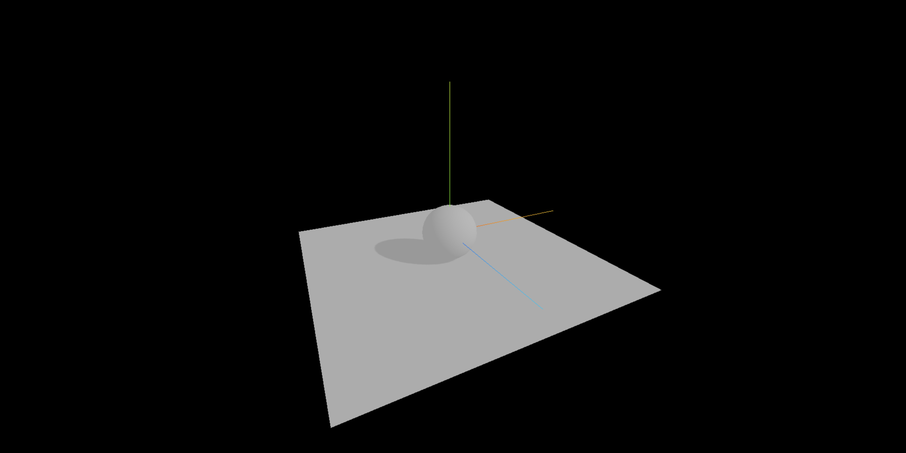

> 效果



> 实现代码

```js
import * as THREE from 'three';
import { OrbitControls } from 'three/examples/jsm/controls/OrbitControls';

// 灯光与阴影的关系与设置

const scene = new THREE.Scene();
const camera = new THREE.PerspectiveCamera(
  75,
  window.innerWidth / window.innerHeight,
  0.1,
  1000
);

camera.position.set(0, 0, 10);
scene.add(camera);

// 创建一个球体
const sphereGeometry = new THREE.SphereGeometry();
const sphereMaterial = new THREE.MeshStandardMaterial();
const sphere = new THREE.Mesh(sphereGeometry, sphereMaterial);
// 3.设置物体投射阴影
sphere.castShadow = true;
scene.add(sphere);

// 创建一个平面
const planeGeometry = new THREE.PlaneGeometry(10, 10);
const planeMaterial = new THREE.MeshStandardMaterial();
const plane = new THREE.Mesh(planeGeometry, planeMaterial);
plane.position.y = -1;
plane.rotation.x = -Math.PI / 2;
// 4.设置物体接收阴影
plane.receiveShadow = true;
scene.add(plane);

const light = new THREE.AmbientLight('#ffffff'); // 添加环境光
scene.add(light);

// 从上方照射的白色平行光，强度为 0.5。
const directionalLight = new THREE.DirectionalLight(0xffffff, 0.5); // 添加平行光
directionalLight.position.set(0, 1, 0); // 假如这个值设置为 Object3D.DEFAULT_UP (0, 1, 0)，光线将会从上往下照射
directionalLight.position.set(10, 10, 10); // 假如这个值设置为 Object3D.DEFAULT_UP (0, 1, 0)，光线将会从上往下照射

// 2.设置光照投射阴影
directionalLight.castShadow = true;
scene.add(directionalLight);

const renderer = new THREE.WebGLRenderer();
renderer.setSize(window.innerWidth, window.innerHeight);
document.body.appendChild(renderer.domElement);

// 1.设置渲染器开启对阴影的计算
renderer.shadowMap.enabled = true;

const controls = new OrbitControls(camera, renderer.domElement);
controls.enableDamping = true;

const axesHelper = new THREE.AxesHelper(5);
scene.add(axesHelper);

const render = () => {
  requestAnimationFrame(render);
  controls.update();
  renderer.render(scene, camera);
};

render();

// 根据尺寸的变化实现自适应画面

// 1.监听页面变化, 更新并渲染画面
window.addEventListener('resize', () => {
  console.log('变化');

  // 2.更新摄像头
  camera.aspect = window.innerWidth / window.innerHeight;

  // 3.更新摄像机的投影矩阵
  camera.updateProjectionMatrix();

  // 4.更新渲染器
  renderer.setSize(window.innerWidth, window.innerHeight);

  // 5.设置渲染器的像素比
  renderer.setPixelRatio(window.devicePixelRatio);
});
```

> 总结

**要实现显示阴影的前提有以下几点:**

1. 材质要满足能够对光照有反应
2. 将渲染器设置为开启对阴影的计算: renderer.shadowMap.enabled = true;
3. 设置光照投射阴影: directionalLight.castShadow = true;
4. 设置物体投射阴影: sphere.castShadow = true;
5. 设置物体接收阴影: plane.receiveShadow = true;
