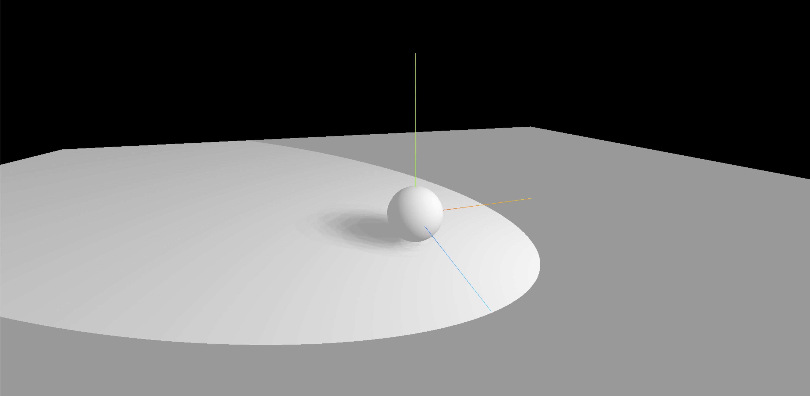

> 效果



```js
import * as THREE from 'three';
import { OrbitControls } from 'three/examples/jsm/controls/OrbitControls';

// 聚光灯

const scene = new THREE.Scene();
const camera = new THREE.PerspectiveCamera(
  75,
  window.innerWidth / window.innerHeight,
  0.1,
  1000
);

camera.position.set(0, 0, 10);
scene.add(camera);

// 创建一个球体
const sphereGeometry = new THREE.SphereGeometry(1, 20, 20);
const sphereMaterial = new THREE.MeshStandardMaterial();
const sphere = new THREE.Mesh(sphereGeometry, sphereMaterial);
// 3.设置物体投射阴影
sphere.castShadow = true;
scene.add(sphere);

// 创建一个平面
const planeGeometry = new THREE.PlaneGeometry(50, 50);
const planeMaterial = new THREE.MeshStandardMaterial();
const plane = new THREE.Mesh(planeGeometry, planeMaterial);
plane.position.set(0, -1, 0);
plane.rotation.x = -Math.PI / 2;
// 4.设置物体接收阴影
plane.receiveShadow = true;
scene.add(plane);

const light = new THREE.AmbientLight('#ffffff'); // 添加环境光
scene.add(light);

// 设置聚光灯
const spotLight = new THREE.SpotLight(0xffffff, 1);
spotLight.position.set(5, 5, 5);
spotLight.castShadow = true; // 灯光将投射阴影
spotLight.intensity = 2; // 光照强度。默认值为 1
spotLight.shadow.radius = 20; // 设置阴影贴图模糊度
spotLight.shadow.mapSize.set(512, 512); // 设置阴影贴图的分辨率
spotLight.target = sphere; // 光从它的位置（position）指向目标位置。默认的目标位置为(0, 0, 0)
spotLight.angle = Math.PI / 6; // 光线照射范围的角度。默认值为 Math.PI/3
spotLight.distance = 0; // 光源照射的最大距离。默认值为 0（无限远）
spotLight.penumbra = 0; // 聚光锥的半影衰减百分比。默认值为 0
spotLight.decay = 0; // 沿着光照距离的衰减量。默认值为 2

// 将聚光灯添加到场景中
scene.add(spotLight);

const renderer = new THREE.WebGLRenderer();
renderer.setSize(window.innerWidth, window.innerHeight);
document.body.appendChild(renderer.domElement);

// 1.设置渲染器开启对阴影的计算
renderer.shadowMap.enabled = true;

const controls = new OrbitControls(camera, renderer.domElement);
controls.enableDamping = true;

const axesHelper = new THREE.AxesHelper(5);
scene.add(axesHelper);

const render = () => {
  requestAnimationFrame(render);
  controls.update();
  renderer.render(scene, camera);
};

render();

// 根据尺寸的变化实现自适应画面

// 1.监听页面变化, 更新并渲染画面
window.addEventListener('resize', () => {
  console.log('变化');

  // 2.更新摄像头
  camera.aspect = window.innerWidth / window.innerHeight;

  // 3.更新摄像机的投影矩阵
  camera.updateProjectionMatrix();

  // 4.更新渲染器
  renderer.setSize(window.innerWidth, window.innerHeight);

  // 5.设置渲染器的像素比
  renderer.setPixelRatio(window.devicePixelRatio);
});
```
