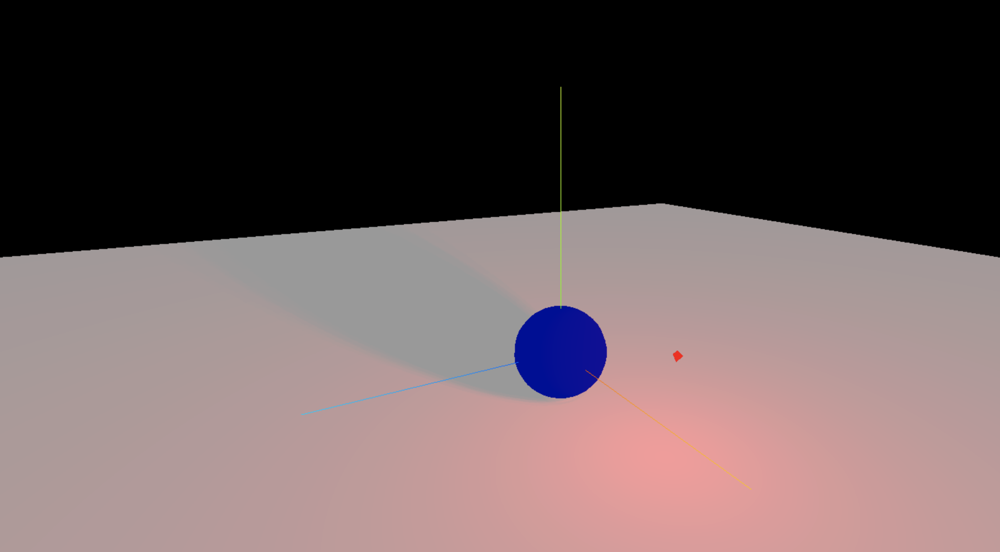

> 效果



```js
import * as THREE from 'three';
import { OrbitControls } from 'three/examples/jsm/controls/OrbitControls';
import * as dat from 'dat.gui';

// 点光源

const scene = new THREE.Scene();
const camera = new THREE.PerspectiveCamera(
  75,
  window.innerWidth / window.innerHeight,
  0.1,
  1000
);

camera.position.set(0, 0, 10);
scene.add(camera);

// 创建一个球体
const sphereGeometry = new THREE.SphereGeometry(1, 20, 20);
const sphereMaterial = new THREE.MeshStandardMaterial({ color: 0x0000ff });
const sphere = new THREE.Mesh(sphereGeometry, sphereMaterial);
// 3.设置物体投射阴影
sphere.castShadow = true;
scene.add(sphere);

// 创建一个平面
const planeGeometry = new THREE.PlaneGeometry(50, 50);
const planeMaterial = new THREE.MeshStandardMaterial();
const plane = new THREE.Mesh(planeGeometry, planeMaterial);
plane.position.set(0, -1, 0);
plane.rotation.x = -Math.PI / 2;
// 4.设置物体接收阴影
plane.receiveShadow = true;
scene.add(plane);

const light = new THREE.AmbientLight('#ffffff'); // 添加环境光
scene.add(light);

// 设置聚光灯
const pointLight = new THREE.PointLight(0xff0000);
// pointLight.position.set(2, 2, 2);
pointLight.castShadow = true;
pointLight.intensity = 2;
// 设置阴影贴图模糊度
pointLight.shadow.radius = 20;
// 设置阴影贴图的分辨率
pointLight.shadow.mapSize.set(512, 512);
pointLight.decay = 0;
// scene.add(pointLight);

// 创建一个小点
const smallBox = new THREE.Mesh(
  new THREE.SphereGeometry(0.1, 2, 2),
  new THREE.MeshBasicMaterial({ color: 0xff0000 })
);

smallBox.position.set(2, 2, 2);

// 将小点作为聚光灯的父级
smallBox.add(pointLight);
scene.add(smallBox);

const renderer = new THREE.WebGLRenderer();
renderer.setSize(window.innerWidth, window.innerHeight);
// 1.设置渲染器开启对阴影的计算
renderer.shadowMap.enabled = true;
// renderer.physicallycorrectLights = true;
document.body.appendChild(renderer.domElement);

const controls = new OrbitControls(camera, renderer.domElement);
controls.enableDamping = true;

const axesHelper = new THREE.AxesHelper(5);
scene.add(axesHelper);

// 时钟
const clock = new THREE.Clock();

const render = () => {
  const time = clock.getElapsedTime();
  smallBox.position.x = Math.sin(time) * 3;
  smallBox.position.z = Math.cos(time) * 3;
  smallBox.position.y = 2 + Math.sin(time * 10);
  console.log(smallBox.position.x);
  requestAnimationFrame(render);
  controls.update();
  renderer.render(scene, camera);
};

render();

// 根据尺寸的变化实现自适应画面

// 1.监听页面变化, 更新并渲染画面
window.addEventListener('resize', () => {
  console.log('变化');

  // 2.更新摄像头
  camera.aspect = window.innerWidth / window.innerHeight;

  // 3.更新摄像机的投影矩阵
  camera.updateProjectionMatrix();

  // 4.更新渲染器
  renderer.setSize(window.innerWidth, window.innerHeight);

  // 5.设置渲染器的像素比
  renderer.setPixelRatio(window.devicePixelRatio);
});

const gui = new dat.GUI();

gui.add(pointLight, 'distance').name('distance').min(0.01).max(5).step(0.01);
gui.add(pointLight, 'intensity').name('intensity').min(0.01).max(5).step(0.01);
gui.add(pointLight, 'decay').name('decay').min(0.01).max(5).step(0.01);
```
