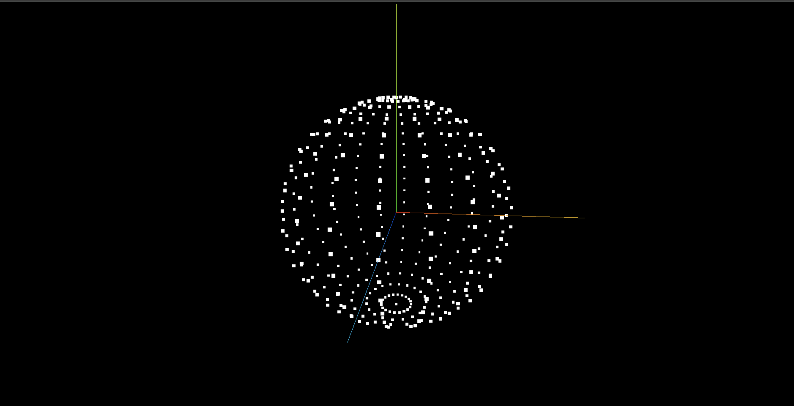

> 效果



> 实现代码

```js
import * as THREE from 'three';
import { OrbitControls } from 'three/examples/jsm/controls/OrbitControls';

const scene = new THREE.Scene();

const camera = new THREE.PerspectiveCamera(
  75,
  window.innerWidth / window.innerHeight,
  0.1,
  1000
);

const sphereGeometry = new THREE.SphereGeometry(3, 20, 20);
// const material = new THREE.MeshBasicMaterial({
//   color: 0xff0000,
//   wireframe: true,
//   });
// const mesh = new THREE.Mesh(sphereGeometry, material);
// scene.add(mesh);

// 创建points材质
const pointsMaterial = new THREE.PointsMaterial();
pointsMaterial.size = 0.1; // 设置点的大小。默认值为1.0。
const points = new THREE.Points(sphereGeometry, pointsMaterial);
scene.add(points);

camera.position.set(0, 0, 10);
scene.add(camera);

const renderer = new THREE.WebGLRenderer();
renderer.setSize(window.innerWidth, window.innerHeight);
document.body.appendChild(renderer.domElement);

const controls = new OrbitControls(camera, renderer.domElement);
controls.enableDamping = true;

const axesHelper = new THREE.AxesHelper(5);
scene.add(axesHelper);

const render = () => {
  renderer.render(scene, camera);
  controls.update();
  requestAnimationFrame(render);
};

render();
```
