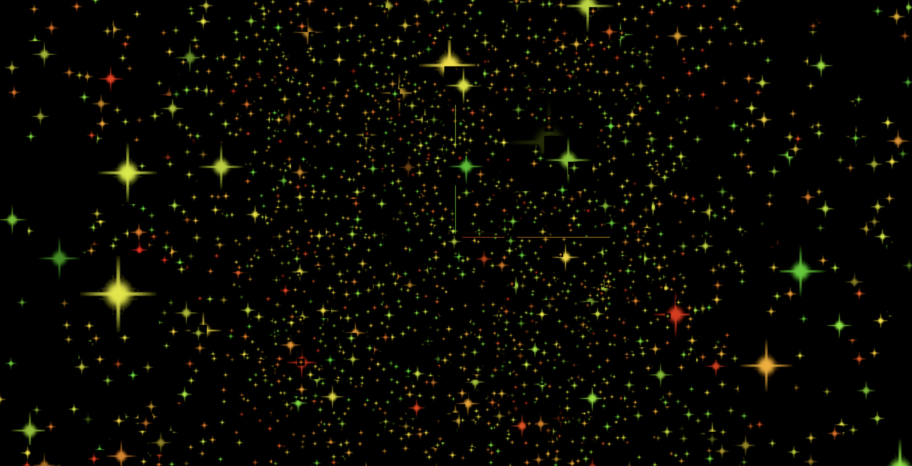

> 效果



> 实现代码

```js
import * as THREE from 'three';
import { OrbitControls } from 'three/examples/jsm/controls/OrbitControls';

const scene = new THREE.Scene();

const camera = new THREE.PerspectiveCamera(
  75,
  window.innerWidth / window.innerHeight,
  0.1,
  1000
);

const particlesGeometry = new THREE.BufferGeometry();
// 想要创建的points数量
const count = 5000;
// 设置缓冲区数组
const positions = new Float32Array(count * 3);
// 设置粒子的每个顶点的颜色
const colors = new Float32Array(count * 3);

// 设置顶点
for (let i = 0; i < count * 3; i++) {
  colors[i] = Math.random();
  positions[i] = (Math.random() - 0.5) * 30;
}

// 设置顶点
particlesGeometry.setAttribute(
  'position',
  new THREE.BufferAttribute(positions, 3)
);

// 设置颜色
particlesGeometry.setAttribute('color', new THREE.BufferAttribute(colors, 3));

// 设置材质
const pointsMaterial = new THREE.PointsMaterial();
pointsMaterial.color.set(0xfff000);
pointsMaterial.size = 0.5;
pointsMaterial.alphaMap = texture;
pointsMaterial.transparent = true;
pointsMaterial.depthWrite = false;
pointsMaterial.sizeAttenuation = true; // 指定点的大小是否因相机深度而衰减。（仅限透视摄像头。）默认为true。
// 设置启用顶点颜色
pointsMaterial.vertexColors = true;

// 载入纹理
const textureLoader = new THREE.TextureLoader();
const texture = textureLoader.load('./textures/particles/8.png');
// 设置纹理
pointsMaterial.map = texture;

const points = new THREE.Points(particlesGeometry, pointsMaterial);
scene.add(points);

camera.position.set(0, 0, 10);
scene.add(camera);

const renderer = new THREE.WebGLRenderer();
renderer.setSize(window.innerWidth, window.innerHeight);
document.body.appendChild(renderer.domElement);

const controls = new OrbitControls(camera, renderer.domElement);
controls.enableDamping = true;

const axesHelper = new THREE.AxesHelper(5);
scene.add(axesHelper);

const render = () => {
  renderer.render(scene, camera);
  controls.update();
  requestAnimationFrame(render);
};

render();
```
