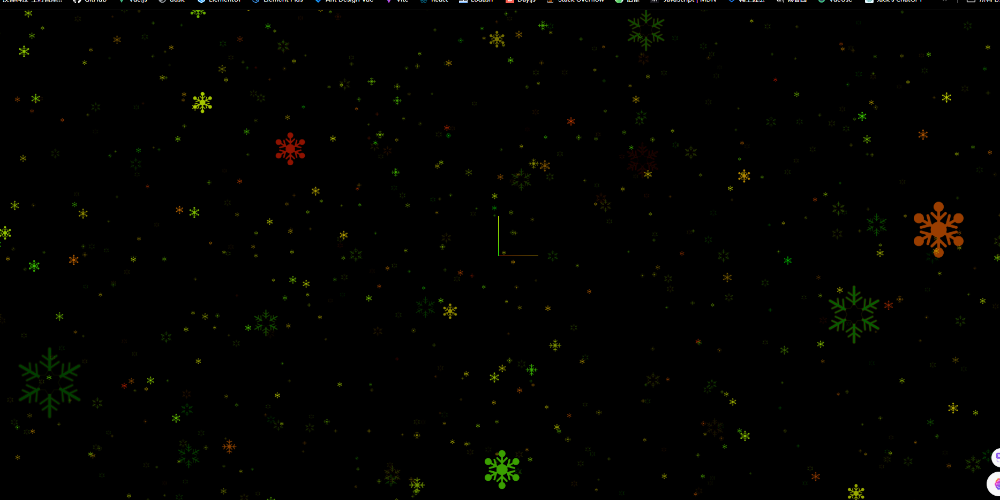

> 效果



> 实现代码

```js
import * as THREE from 'three';
import { OrbitControls } from 'three/examples/jsm/controls/OrbitControls';

const scene = new THREE.Scene();

const camera = new THREE.PerspectiveCamera(
  75,
  window.innerWidth / window.innerHeight,
  0.1,
  40
);
camera.position.set(0, 0, 40);
scene.add(camera);

const createPoints = (
  textureUrl,
  pointsCount = 5000,
  pointsMaterialSize = 0.5
) => {
  const particlesGeometry = new THREE.BufferGeometry();
  // 想要创建的points数量
  const count = pointsCount;
  // 设置缓冲区数组
  const positions = new Float32Array(count * 3);
  // 设置粒子的每个顶点的颜色
  const colors = new Float32Array(count * 3);

  // 设置顶点
  for (let i = 0; i < count * 3; i++) {
    colors[i] = Math.random();
    positions[i] = (Math.random() - 0.5) * 100;
  }

  // 设置顶点
  particlesGeometry.setAttribute(
    'position',
    new THREE.BufferAttribute(positions, 3)
  );

  // 设置颜色
  particlesGeometry.setAttribute('color', new THREE.BufferAttribute(colors, 3));

  // 载入纹理
  const textureLoader = new THREE.TextureLoader();
  const texture = textureLoader.load(`./textures/particles/${textureUrl}.png`);
  // 设置材质
  const pointsMaterial = new THREE.PointsMaterial();
  pointsMaterial.color.set(0xfff000);
  pointsMaterial.size = pointsMaterialSize;
  pointsMaterial.alphaMap = texture;
  pointsMaterial.map = texture;
  pointsMaterial.transparent = true;
  pointsMaterial.depthWrite = false;
  pointsMaterial.sizeAttenuation = true; // 指定点的大小是否因相机深度而衰减。（仅限透视摄像头。）默认为true。
  // 设置启用顶点颜色
  pointsMaterial.vertexColors = true;

  const points = new THREE.Points(particlesGeometry, pointsMaterial);
  scene.add(points);
  return points;
};

const points = createPoints('xh', 2000, 1);
const points2 = createPoints('xh2', 3000, 0.8);
const points3 = createPoints('xh3', 2000, 0.7);

const renderer = new THREE.WebGLRenderer();
renderer.setSize(window.innerWidth, window.innerHeight);
document.body.appendChild(renderer.domElement);

const controls = new OrbitControls(camera, renderer.domElement);
controls.enableDamping = true;

const axesHelper = new THREE.AxesHelper(5);
scene.add(axesHelper);

const clock = new THREE.Clock();
const render = () => {
  const time = clock.getElapsedTime();
  points.rotation.x = time * 0.09;
  points2.rotation.x = time * 0.07;
  points2.rotation.y = time * 0.07;
  points3.rotation.x = time * 0.05;
  points3.rotation.x = time * 0.05;
  renderer.render(scene, camera);
  controls.update();
  requestAnimationFrame(render);
};

render();
```
