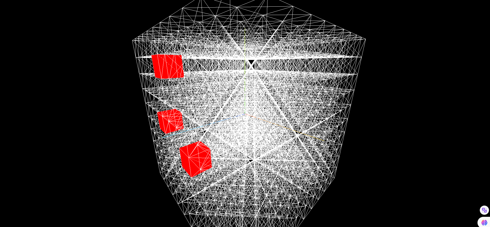

> 效果



> 实现代码

```js
import * as THREE from 'three';
import { OrbitControls } from 'three/examples/jsm/controls/OrbitControls';

const scene = new THREE.Scene();
const camera = new THREE.PerspectiveCamera(
  75,
  window.innerWidth / window.innerHeight,
  0.1,
  1000
);

camera.position.set(0, 0, 10);
scene.add(camera);
const cubeGeometry = new THREE.BoxGeometry();
const cubeMaterial = new THREE.MeshBasicMaterial({ wireframe: true });
const redMaterial = new THREE.MeshBasicMaterial({ color: 0xff0000 });

// 创建1000个立方体
const cubeArray = [];

for (let i = -5; i < 5; i++) {
  for (let j = -5; j < 5; j++) {
    for (let z = -5; z < 5; z++) {
      const cube = new THREE.Mesh(cubeGeometry, cubeMaterial);
      cube.position.set(i, j, z);
      scene.add(cube);
      cubeArray.push(cube);
    }
  }
}

// 创建投射光线对象
const raycaster = new THREE.Raycaster();

// 鼠标的位置对象
const mouse = new THREE.Vector2();

// 监听鼠标的位置
window.addEventListener('mousemove', (e) => {
  mouse.x = (e.clientX / window.innerWidth) * 2 - 1;
  mouse.y = -((e.clientY / window.innerHeight) * 2 - 1);
  raycaster.setFromCamera(mouse, camera);
  let res = raycaster.intersectObjects(cubeArray);
  // res[0].object.material = redMaterial; // 选中单个
  // res.forEach((item) => (item.object.material = redMaterial)); // 选中穿透
});

// 监听点击
window.addEventListener('dblclick', (e) => {
  mouse.x = (e.clientX / window.innerWidth) * 2 - 1;
  mouse.y = -((e.clientY / window.innerHeight) * 2 - 1);
  raycaster.setFromCamera(mouse, camera);
  let res = raycaster.intersectObjects(cubeArray);
  res[0].object.material = redMaterial;
});

const renderer = new THREE.WebGLRenderer();
renderer.setSize(window.innerWidth, window.innerHeight);
document.body.appendChild(renderer.domElement);

const controls = new OrbitControls(camera, renderer.domElement);
controls.enableDamping = true;

const axesHelper = new THREE.AxesHelper(5);
scene.add(axesHelper);

const render = () => {
  requestAnimationFrame(render);
  renderer.render(scene, camera);
  controls.update();
};
render();
```
