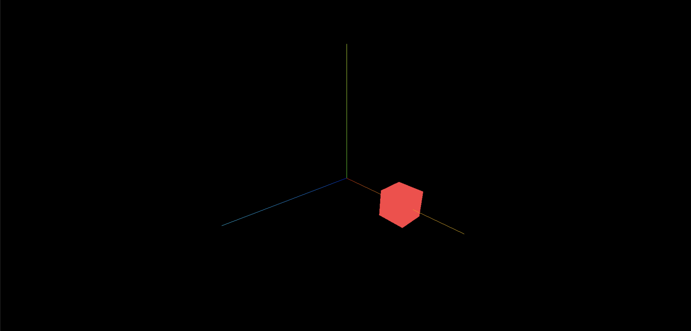

> 效果
> 

> 实现代码

```js
import * as THREE from 'three';
import { OrbitControls } from 'three/examples/jsm/controls/OrbitControls';

// 设置物体的移动

const scene = new THREE.Scene();

const camera = new THREE.PerspectiveCamera(
  75,
  window.innerWidth / window.innerHeight,
  0.1,
  1000
);

camera.position.set(0, 0, 10);
scene.add(camera);

const cubeGeometry = new THREE.BoxGeometry(1, 1, 1);
const cubeMaterial = new THREE.MeshBasicMaterial({ color: 0xff4045 });
const cube = new THREE.Mesh(cubeGeometry, cubeMaterial);
scene.add(cube);
// cube.position.set(5, 0, 0); // 设置三维向量,x,y,z
// 也可以单个设置
// cube.position.setX(5)
// cube.position.setY(3)
// cube.position.setZ(1)

const renderer = new THREE.WebGLRenderer();
renderer.setSize(window.innerWidth, window.innerHeight);
document.body.appendChild(renderer.domElement);

const controls = new OrbitControls(camera, renderer.domElement);

const axesHelper = new THREE.AxesHelper(5);
scene.add(axesHelper);

const render = () => {
  // 如果物体的x轴距离小于5,每次刷新帧率时就加0.1,到5就归零,反复循环
  if (cube.position.x < 5) {
    cube.position.x += 0.1;
  } else {
    cube.position.x = 0;
  }
  requestAnimationFrame(render);
  controls.update();
  renderer.render(scene, camera);
};

render();
```

> 总结

1. 设置物体移动的三维向量, set 方法: 物体名.position.set(x, y, z)
2. 设置物体移动的单个向量:

- 物体名.position.setX(number)
- 物体名.position.setY(number)
- 物体名.position.setZ(number)
